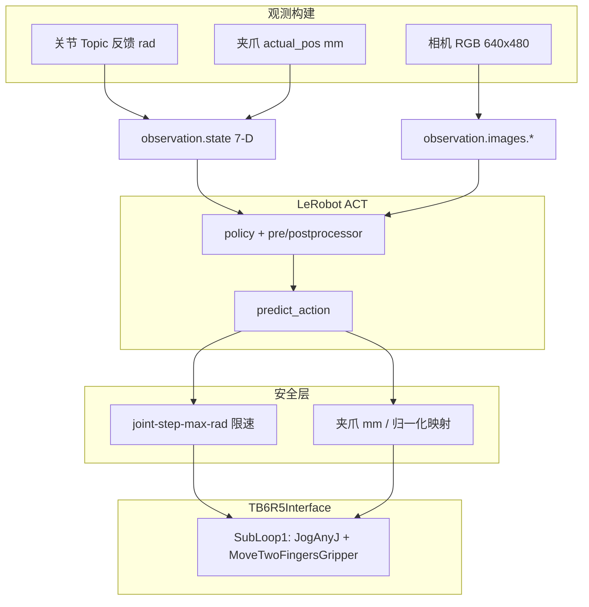

# TB6-R5 ACT 真机推理接口说明

本文档描述 LeRobot ACT 策略在 TB6-R5 真机上的**观测 / 动作数据契约**、**控制与 RPC 下发路径**、**CLI 参数**与**相机模式**。与逐步部署流程（评估 → dry-run → 真机）配合阅读：[ACT_Deployment_Guide.md](../ACT_Deployment_Guide.md)。

---

## 1. 入口

两套入口逻辑等价，参数基本一致：

| 入口 | 命令 | 说明 |
|------|------|------|
| **脚本** | `python scripts/hardware/policy_infer_tb6r5_act.py` | 仓库内单文件，依赖本仓库 `lerobot` 导入路径 |
| **打包 CLI** | `tb6r5-policy-infer` | 包 `tb6r5_policy_infer`；安装见 [tb6r5_policy_infer/README.md](../tb6r5_policy_infer/README.md) |

离线评估（数据集 MAE、无真机）使用 **`tb6r5-policy-eval`**，接口见同包 README，不在本文范围。

---

## 2. 推理数据流



每个控制周期（频率 `--fps`，默认 20 Hz）：

1. 读机器人状态、采图，组装 `observation` dict  
2. `predict_action()` → 7 维 `action`  
3. 关节限速、夹爪处理  
4. （非 `--dry-run`）经 `TB6R5Interface` 发 RPC  

---

## 3. 观测接口（Observation）

传入 `predict_action(observation=..., task=..., robot_type="tb6r5")` 的字典**必须与训练数据集 schema 一致**。

### 3.1 `observation.state`

7 维 `float32` 向量：`[q0, q1, q2, q3, q4, q5, gripper]`

| 下标 | 单位 | 真机推理来源 | 说明 |
|------|------|--------------|------|
| 0–5 | rad | `TB6R5Interface.get_joint_positions()` | Topic 关节角反馈；`--dry-run` 时为 0 |
| 6 | mm 或 [0,1] | 夹爪 `actual_pos` 反馈（mm） | 见下方夹爪单位；可用 `--gripper-observation-constant` 强制常数（mm） |

**打包 CLI 专属：** `--gripper-normalized` 时，`state[6] = clip(feedback_mm / gripper_max_distance, 0, 1)`。

### 3.2 `observation.images.<name>`

| 字段 | 类型 | 默认形状 | 说明 |
|------|------|----------|------|
| `observation.images.realsense_0` | `uint8` RGB HWC | `(480, 640, 3)` | 逻辑名须与数据集一致 |
| `observation.images.realsense_1` | `uint8` RGB HWC | `(480, 640, 3)` | 双相机训练时必需 |

- 分辨率由 `--camera-width`（640）、`--camera-height`（480）决定，与训练不一致时会 resize。  
- `--no-camera` 时喂全黑图，**仅调试**，策略输出无意义。

### 3.3 其它传入字段

| 参数 | 默认 | 作用 |
|------|------|------|
| `task` | `tb6r5 teleoperation` | 写入 policy 的 task 条件（`--task`） |
| `robot_type` | `"tb6r5"` | LeRobot 处理器路由（代码内固定） |

---

## 4. 动作接口（Action）

`predict_action` 返回 7 维 `float32`：`[q0..q5, gripper]`，经后处理反归一化后的**物理量**（与训练标签同单位）。

| 下标 | 单位 | 下发前处理 | 真机 RPC |
|------|------|------------|----------|
| 0–5 | rad | `q_cmd = q_current + clip(q_tgt - q_cur, ±joint_step_max)` | `JogAnyJ`（`--joint-step-max-rad`，默认 0.03） |
| 6 | mm 或 [0,1] | clip / 映射为 mm | `MoveTwoFingersGripper`（见第 6 节） |

打印字段含义：

- `q_cur`：当前关节角  
- `q_tgt`：模型原始预测  
- `q_cmd`：限速后实际下发值  

---

## 5. 机器人 RPC 接口

真机命令不经 LeRobot，由 `xrobotoolkit_teleop.hardware.interface.tb6r5.TB6R5Interface` 发出。

| 项目 | 默认值 / 说明 |
|------|----------------|
| 传输 | 厂商 `rpc.so` → `CPPClient(ip, port)` |
| 地址 | `--robot-ip`，`--rpc-port`（默认 **5868**） |
| 默认下发 | **SubLoop1** 双流：`{JogAnyJ ... \|\| MoveTwoFingersGripper ...}` |
| 复位 | `MoveAbsJ` + 夹爪张开；`--home-joint-deg`（6 个关节度） |
| SDK | `dependencies/.../rpc.so`、`topic.so`（**不进 git**） |

验证 SDK（真机前建议）：

```bash
python scripts/hardware/verify_tb6r5_sdk.py --robot-ip 192.168.11.11 --send-test-cmd
```

`--dry-run`：**不** `connect()` 机器人，不发 RPC；相机仍可采集（除非 `--no-camera`）。

---

## 6. 夹爪接口

### 6.1 单位

| 模式 | 参数 | `state[6]` | `action[6]` → 下发 |
|------|------|------------|-------------------|
| **mm（默认）** | 无 | 反馈 mm | clip 到 `[0, max]` 后直接 mm |
| **归一化** | `--gripper-normalized`（仅 `tb6r5-policy-infer`） | `mm / max` → [0,1] | `norm × max` → mm |

`--gripper-max-distance` 默认 **70** mm（0=全闭合，70=全开），须与训练一致。

### 6.2 连续 vs 迟滞

| 模式 | 参数 | 行为 |
|------|------|------|
| **连续 mm（默认）** | `--gripper-continuous` | 每步 SubLoop1 带关节 + 夹爪；变化 &lt; `--gripper-cmd-delta`（0.5 mm）时夹爪子命令为 `NotRunExecute` 防刷队列 |
| **二值迟滞** | `--no-gripper-continuous` | 按 action mm 与 `--gripper-close-mm` / `--gripper-open-mm` 滞回，边沿发 min/max mm |

`--gripper-interval`：`MoveTwoFingersGripper` 的 interval 参数（脚本/包默认 5.0）。

---

## 7. 相机接口

逻辑名（`realsense_0`、`realsense_1`）**固定对齐数据集**；仅物理绑定方式可变。

### 7.1 RealSense（默认）

```bash
--camera-serials 'realsense_0=135522071053,realsense_1=327122073649'
```

省略时使用 `constants.py` / 脚本内 `DEFAULT_REALSENSE_SERIAL_DICT`。依赖 `pyrealsense2`（主包）。

查 SN：

```bash
python -c "import pyrealsense2 as rs; print([d.get_info(rs.camera_info.serial_number) for d in rs.context().query_devices()])"
```

### 7.2 V4L2 `/dev/video*`

无需 `pyrealsense2`，适合 TER30 等 `libusb` 有问题环境：

```bash
--camera-devices 'realsense_0=/dev/video0,realsense_1=/dev/video4'
# 或数字索引
--camera-devices 'realsense_0=0,realsense_1=4'
```

指定 `--camera-devices` 时**忽略** `--camera-serials`。RealSense 会暴露多个 `/dev/video*`，需用 `v4l2-ctl --list-devices` 确认 **RGB 采集节点**。

### 7.3 HTTP URL

相机由远程 HTTP 服务提供（如 `RsCameraSensor`），推理机无需本地 RealSense / V4L2：

```bash
--camera-urls 'realsense_0=http://192.168.2.42:8888/RsCameraSensor/0/0/color,realsense_1=http://192.168.2.42:8888/RsCameraSensor/1/0/color'
```

| 项目 | 说明 |
|------|------|
| 协议 | 每个逻辑相机对应一个 URL，后台线程 **HTTP GET** 轮询 |
| 响应格式 | 响应体为 **JPEG/PNG** 字节流（`cv2.imdecode` 解码） |
| 逻辑名 | `realsense_0` / `realsense_1` 须与训练数据集一致 |
| 优先级 | 设置 `--camera-urls` 后忽略 `--camera-serials` 与 `--camera-devices` |
| 依赖 | `opencv-python` + Python 标准库 `urllib`（无需 `pyrealsense2`） |

验证单个 URL：

```bash
curl -s -o /tmp/cam0.jpg 'http://192.168.2.42:8888/RsCameraSensor/0/0/color' && file /tmp/cam0.jpg
```

示例（dry-run）：

```bash
tb6r5-policy-infer \
  --robot-ip 192.168.11.11 \
  --policy-path model/act/080000/pretrained_model \
  --camera-urls 'realsense_0=http://192.168.2.42:8888/RsCameraSensor/0/0/color,realsense_1=http://192.168.2.42:8888/RsCameraSensor/1/0/color' \
  --dry-run
```

### 7.4 无相机

```bash
--no-camera
```

### 7.5 公共参数

| 参数 | 默认 |
|------|------|
| `--camera-width` | 640 |
| `--camera-height` | 480 |
| `--camera-fps` | 30 |
| `--show-camera` / `--no-show-camera` | 默认开启 OpenCV 预览 |

---

## 8. ACT 部署参数

| 参数 | 默认 | 说明 |
|------|------|------|
| `--policy-path` | （必填） | `pretrained_model` 目录（含 `config.json`、`model.safetensors`、processor json） |
| `--dataset-root` + `--repo-id` | 可选 | 一般不需要；checkpoint 已烘焙归一化统计 |
| `--device` | 脚本 `cuda`；包 `auto` | 推理设备 |
| `--n-action-steps` | checkpoint | 覆盖 ACT 队列步长（1…chunk_size） |
| `--temporal-ensemble-coeff` | 无 | 如 `0.01` 启用时间集成；隐含 `n_action_steps=1` |
| `--refresh-policy-every-step` | 关 | 每步 `policy.reset()`，更灵敏、更慢 |

三者互斥注意：不要同时开 `--temporal-ensemble-coeff` 与 `--refresh-policy-every-step`。

---

## 9. 安全与生命周期

| 参数 | 默认 | 说明 |
|------|------|------|
| `--dry-run` | 关 | 只推理打印，不发 RPC |
| `--fps` | 20 | 控制循环频率；首次真机建议 10 |
| `--joint-step-max-rad` | 0.03 | 每步最大关节变化（rad） |
| `--home-joint-deg` | 见 constants | 启动 / Ctrl+C 复位姿态（度） |
| `--home-settle-time` | 3 s | 复位后等待 |
| `--no-home-on-start` / `--no-home-on-exit` | 关 | 跳过启动或退出复位 |
| `--print-every` | 0.5 s | 调试打印间隔 |

退出：`Ctrl+C` → 停相机 →（可选）复位 → `arm.disable()`。

---

## 10. 命令示例

### 10.1 Dry-run（验证策略 + 相机）

```bash
tb6r5-policy-infer \
  --robot-ip 192.168.11.11 \
  --policy-path model/act/080000/pretrained_model \
  --dry-run
```

### 10.2 TER30 + V4L2 + CPU

```bash
tb6r5-policy-infer \
  --robot-ip 192.168.11.11 \
  --policy-path model/act/080000/pretrained_model \
  --camera-devices 'realsense_0=/dev/video0,realsense_1=/dev/video4' \
  --device cpu \
  --dry-run
```

### 10.3 HTTP 相机服务（RsCameraSensor 等）

```bash
tb6r5-policy-infer \
  --robot-ip 192.168.11.11 \
  --policy-path model/act/080000/pretrained_model \
  --camera-urls 'realsense_0=http://192.168.2.42:8888/RsCameraSensor/0/0/color,realsense_1=http://192.168.2.42:8888/RsCameraSensor/1/0/color' \
  --dry-run
```

### 10.4 训练夹爪为 0–1 归一化（仅打包 CLI）

```bash
tb6r5-policy-infer \
  --robot-ip 192.168.11.11 \
  --policy-path model/act/080000/pretrained_model \
  --gripper-normalized \
  --dry-run
```

### 10.5 真机（去掉 dry-run）

```bash
tb6r5-policy-infer \
  --robot-ip 192.168.11.11 \
  --policy-path model/act/080000/pretrained_model \
  --fps 10 \
  --joint-step-max-rad 0.03 \
  --gripper-max-distance 70
```

---

## 11. 脚本与打包 CLI 差异

| 项目 | `policy_infer_tb6r5_act.py` | `tb6r5-policy-infer` |
|------|----------------------------|----------------------|
| `--device` 默认 | `cuda` | `auto` |
| `--gripper-normalized` | 暂无 | 支持 |
| LeRobot 导入 | 直接 `lerobot.policies.factory` | `lerobot_compat`（兼容 0.4/0.5、Groot stub） |
| `--help` 不装主包 | 需完整依赖 | 支持（真机运行仍需主包） |

新功能优先在 `tb6r5_policy_infer` 维护；脚本保持单文件可运行副本。

---

## 12. 相关文件

| 文件 | 内容 |
|------|------|
| [ACT_Deployment_Guide.md](../ACT_Deployment_Guide.md) | 评估 → dry-run → 真机全流程 |
| [tb6r5_policy_infer/README.md](../tb6r5_policy_infer/README.md) | 安装、TER30、依赖版本 |
| `scripts/hardware/policy_infer_tb6r5_act.py` | 脚本实现与简短 `--help` |
| `tb6r5_policy_infer/tb6r5_policy_infer/runner.py` | 打包版控制循环 |
| `xrobotoolkit_teleop/hardware/interface/tb6r5.py` | RPC / SubLoop1 实现 |
